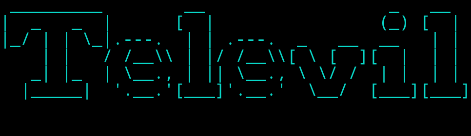

 

**Televil** is an automated script that allows you to spam messages into telegram bots.
**Disclaimer**: Do not use this for evil intentions! Use it with caution!

## Features

- [x] Uses TOR relays to do the requests by default.
- [x] Detects and updates the waiting time to do more requests.
- [x] Message can be customizable.
- [ ] Can't continue when the user of the bot blocks you!

## Usage

`main.py [-h] -id ID -token TOKEN [-message MESSAGE] [-file-message FILE_MESSAGE] [-wait WAIT] [-follow-no-error-time] [-no-tor]`

## Options

| Parameter | Description | Required |
| --------- | ----------- | -------- |
| -h, --help | Show this help message and exit | :white_square_button: |
| -id ID | ID of the bot (e.g.: 6907124010) REQUIRED | :white_check_mark: |
| -token TOKEN | Token of the bot (e.g.: 48302563512:itjhueorpdEv9j31jy1I5BdScXaWpQhjg) REQUIRED | :white_check_mark: |
| -message MESSAGE, -m MESSAGE | Message text to send! | :white_square_button: |
| -file-message FILE_MESSAGE | Reads the message on a file and sets as a text to send! | :white_square_button: |
| -wait WAIT, -w WAIT | Time to wait for the next message (In seconds) | :white_square_button: |
| -follow-no-error-time | This flag is to disable the following error that Telegram App returns when there are too many requests ocurred it returns how many seconds the application should wait to resume the work again! | :white_square_button: |
| -no-tor | This will disable the requests using TOR Proxy! | :white_square_button: |

